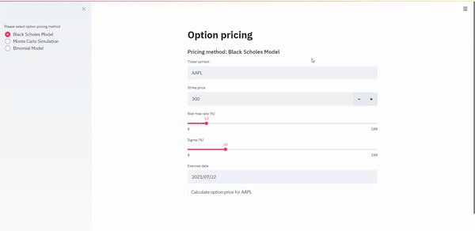
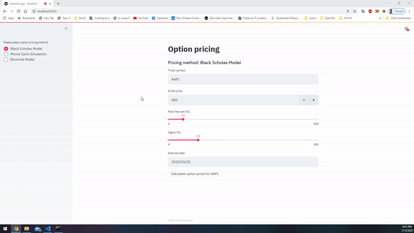
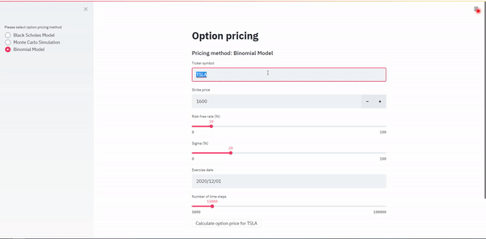

# Pricify Option Modeling Suite

## Introduction
This repository showcases a streamlined web application for calculating the prices of European options using three distinct models:

1. **Black-Scholes Model**  
2. **Monte Carlo Simulation**  
3. **Binomial Model**  

Each model requires the user to input specific parameters, such as:  

- Stock Ticker  
- Strike Price  
- Expiry Date  
- Risk-Free Rate  
- Volatility  

The option pricing models are implemented in **Python 3.7**. Current stock prices are fetched directly from Yahoo Finance API using the `pandas-datareader` library. A simple yet interactive web application, created with **Streamlit**, provides a user-friendly interface for model visualization and testing.  

To optimize performance, previously fetched data is cached using the `requests-cache` library in an SQLite database. This ensures efficiency by avoiding duplicate API requests when testing or adjusting parameters for the same instrument.  

This project was developed as part of the course *Special Functions (Applied Mathematics)* during a Master's program in Software Engineering. 

## Streamlit web app  

1. Black-Scholes model    


2. Monte Carlo Option Pricing  


3. Binomial model    



## Project Structure
The repository includes:  

- **`demo`**: Contains .gif files showcasing examples of the Streamlit app.  
- **`option_pricing`**: A Python package where the models are implemented.  
- **`option_pricing_test.py`**: Example code to test the option pricing models (outside the web app).  
- **`streamlit_app.py`**: A script to launch the web app using the Streamlit framework.  
- **`requirements.txt`**: Lists all Python dependencies for the project.  
- **`Dockerfile`**: For containerizing the Streamlit app.  
- **`app.yaml`**: Configuration for deploying the Dockerized app to Google Cloud Platform (GCP).  

## How to Run the Application
You can test the option pricing models by either running the Streamlit app locally or deploying a Dockerized version.  

### 1. Run via Docker
The **Dockerfile** is configured to expose port 8080, enabling seamless browser-based access upon deployment.  

#### 1.1 Local Docker Setup
1. Build the Docker image with:  
   ```bash
   docker build -t option-pricing:latest .
2. Verify the image is built using:
   ```bash
   docker image ls
3. Run the Docker container with:
   ```bash
   docker run -p 8080:8080 option-pricing:latest

### 2. Run Locally with Python
It’s recommended to use a virtual environment for managing dependencies.

 1. Create and activate a virtual environment:

- On Windows:
```bash

  python -m venv option-pricing  
  option-pricing\Scripts\activate.bat  
```
2. Install the required packages:

``` bash
  pip install -r requirements.txt
```
3. Launch the Streamlit app:
``` bash

streamlit run streamlit_app.py
```
